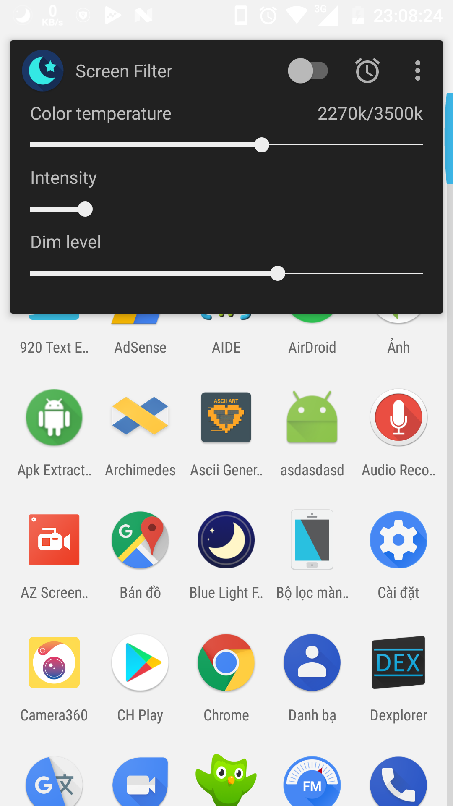
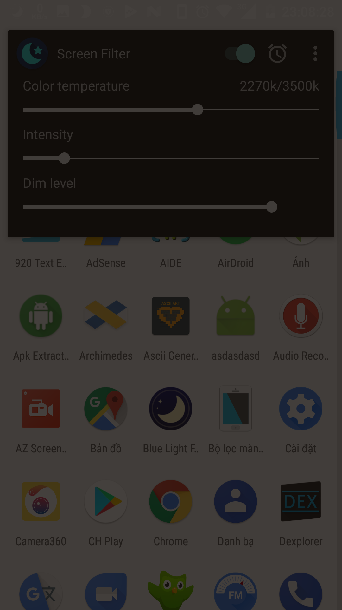
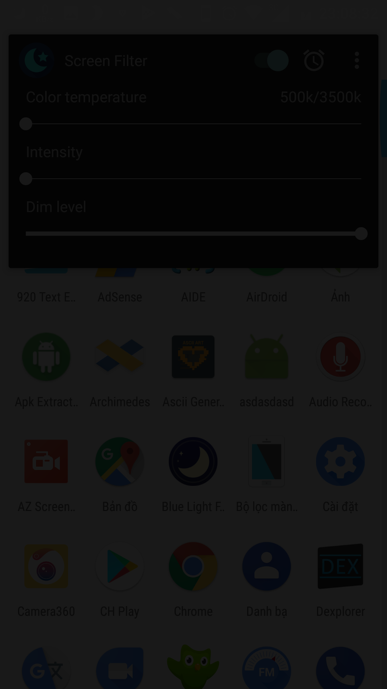
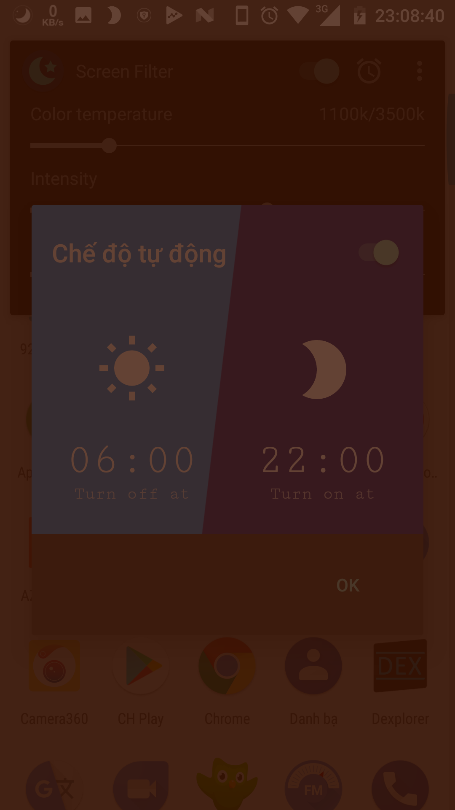
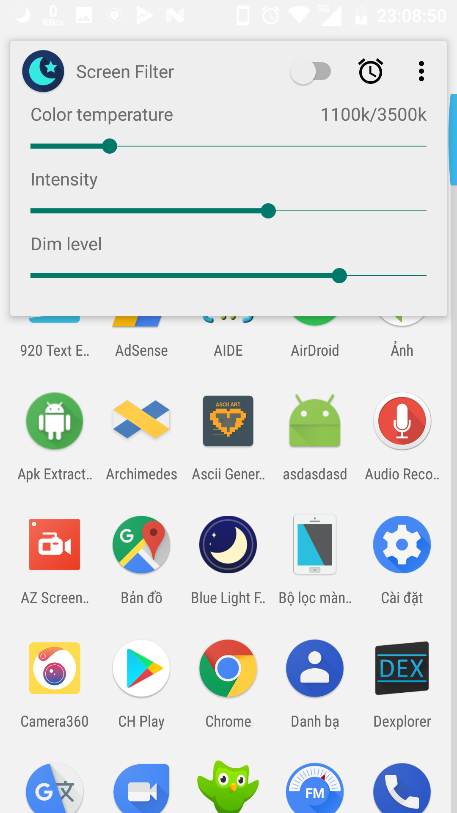
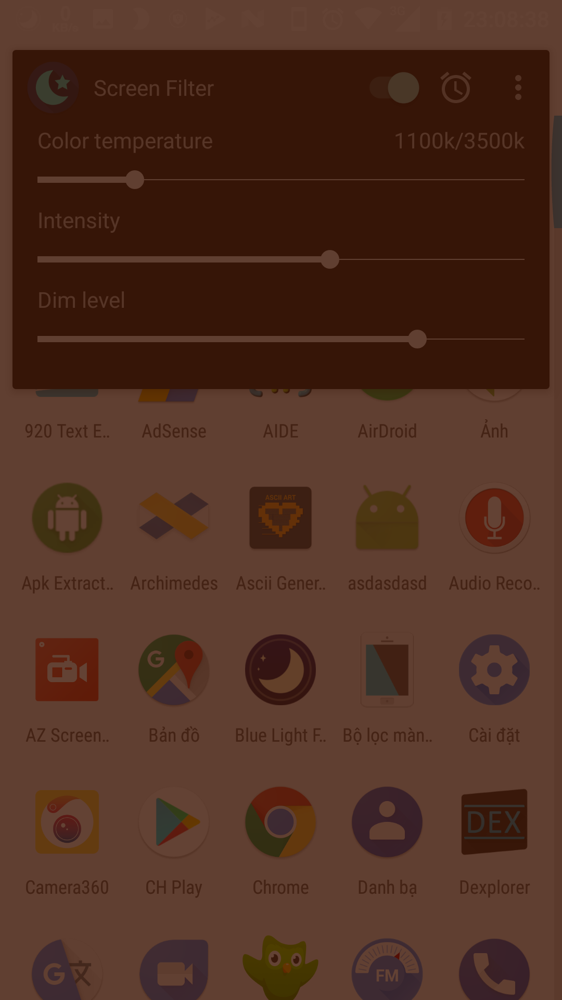

# Screen Filter
This is an application that helps you to reduce eyestrain at night.
This is an open source project to help you learn code, this is free, no ads.

## Feature
- Adjust color temperature
- Adjust the color intensity
- Adjust the opacity of the color
- Auto on/off
- Supports light/dark theme
- Automatically turn off the application when the supersu dialog box or Install button, dialog permission

## Screenshot
|                      |                |                         |
|---------------------:|---------------:|------------------------:|
|| | |
|| | |

## License

    Copyright (C) 2017 Tran Le Duy

    This program is free software: you can redistribute it and/or modify
    it under the terms of the GNU General Public License as published by
    the Free Software Foundation, either version 3 of the License, or
    (at your option) any later version.

    This program is distributed in the hope that it will be useful,
    but WITHOUT ANY WARRANTY; without even the implied warranty of
    MERCHANTABILITY or FITNESS FOR A PARTICULAR PURPOSE.  See the
    GNU General Public License for more details.

    You should have received a copy of the GNU General Public License
    along with this program.  If not, see <http://www.gnu.org/licenses/>.
